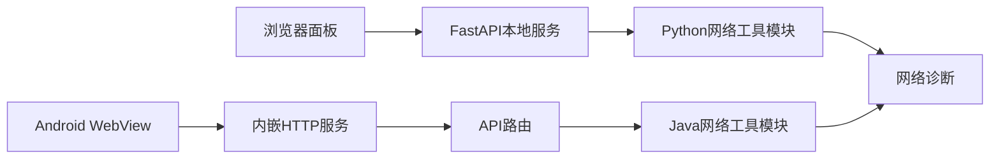
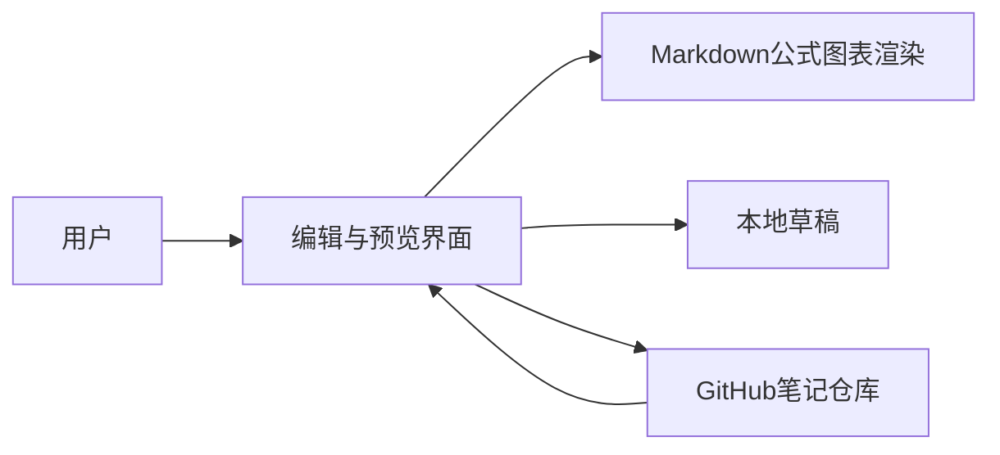
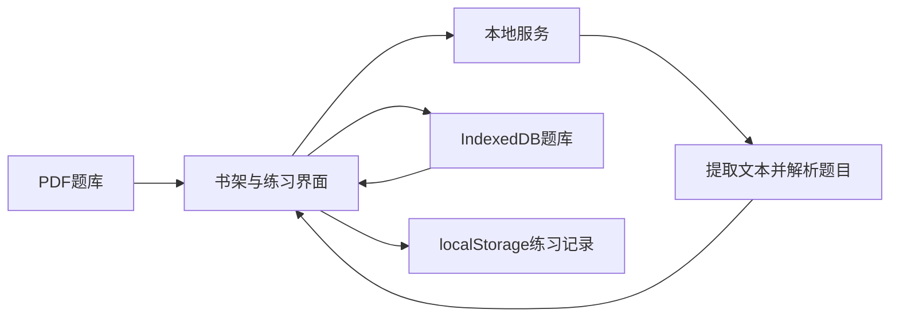

<!-- more -->

最近整理了几个自己做的小项目，记录一下。

### [NetWrench](https://github.com/cfn0324/NetWrench)

一个给软路由和 NAS 使用的网络工具箱，包含网络信息、测速、内网扫描、NAT 检测等功能。桌面版用 FastAPI 提供本地接口；Android 版把服务和 Java 后端一起放进 App，不需要电脑。

### [简记 Markdown](https://github.com/cfn0324/jianji-markdown)

一个面向手机的 Markdown 写作和阅读器。常用格式可以从快捷工具栏插入，也支持公式、Mermaid 图表和离线草稿。笔记可以保存在本地，也可以连接自己的 GitHub 仓库同步。

[在线体验](https://cfn0324.github.io/jianji-markdown/)

### [PDF Quiz Bookshelf](https://github.com/cfn0324/pdf-quiz-bookshelf)

一个本地运行的 PDF 刷题工具。导入符合格式的文本型 PDF 后，会自动整理题目；练习记录保存在浏览器本地，也可以按错题、收藏或未做题继续练习。扫描版 PDF 需要先 OCR。

