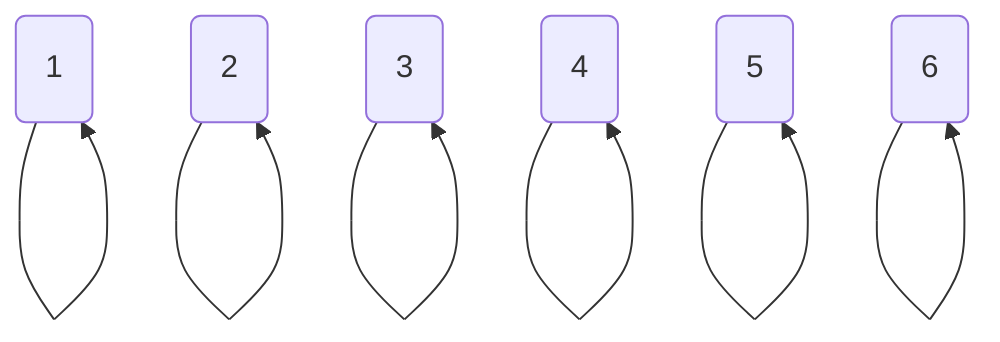
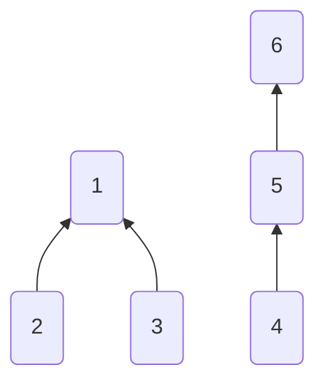
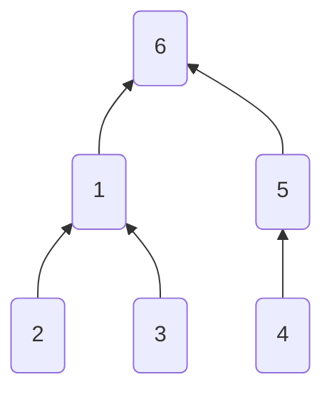
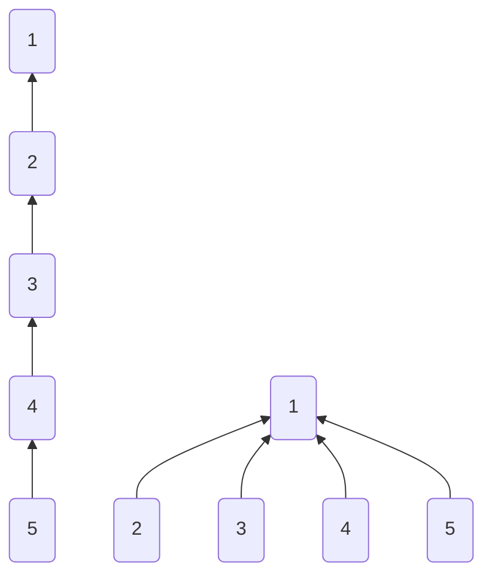

<!-- more -->
### 并查集是什么
并查集是一种用来管理元素分组情况的数据结构。主要有以下两种用法：

* 查询元素a和元素b是否在一组
* 合并元素a和元素b所在的组

注意：并查集可以进行查询和合并操作，但是无法进行分割操作。

### 并查集的结构
并查集本质是树形结构，每个元素对应一个节点，每个组对应一棵树。在并查集中，那个节点是哪个节点的父亲以及树的形状等信息无需多加关注，整体组成一个树形结构才是重要的。
#### 初始化

准备 $n$ 个节点来表示 $n$ 个元素,最开始时边都是自己指向自己。故我们初始化这些节点


```c++
int fa[N+5];

void init(int n){
    for(int i=1;i<=n;i++){
        fa[i]=i;
    }
}
```

#### 合并
   
首先我们需要找到两个要合并的节点的根节点，并将其中的一个根节点指向另一个根节点。

一个节点指向另一个节点，就形成了一颗树，多个组就合并为一个组了。


```c++
int find(int x){
    if(x==fa[x])
        return x;
    else
        return find(fa[x]);
}

void unite(int x,int y){
    fa[find(x)]=fa[find(y)];
}
```

#### 查询

为了查询两个节点是否同属一个组，我们需要沿着树往上走，找到树的根是谁。如果两个节点的根相同，那么就是同属于一个组。

在上图中，$1、2、3$ 的根都是 $1$ ,故 $1、2、3$ 为同一组，而 $4、5、6$ 的根都是 $6$ ，故 $4、5、6$ 为同一组。
```c++
bool same(int x,int y){
    if(find(x)==find(y))
        return true;
    else
        return false;
}
```

### 并查集的注意点
并查集作为一种树状结构，树状结构在一定情况下会退化成链表，会导致复杂度变得很大，所以我们要想办法避免退化的发生。

我们有两种方法来避免发生退化：

1. 使高度小的树向高度高的树合并。
2. 使用路径压缩。

#### 考虑高度的合并
1. 首先我们记录每棵树的高度。
2. 合并时，如果高度不同，我们让高度低的向高度高的合并。
3. 如果高度相同，任意使一棵树指向另一棵树，并将被指的树，高度加一。

下图就是考虑了高度的合并,我们只要加入rank数组，并将unite函数简单修就能实现。



```c++
int rank[N+5];

void unite(int x,int y){
    x=find(x);
    y=find(y);
    if(x==y) return;
    if(rank[x]<rank[y]){
        fa[x]=fa[y];
    }else{
        fa[y]=fa[x];
        if(rank[x]==rank[y])
            rank[x]++;
    }
}
```

#### 路径压缩的合并
对于每个节点，一旦向上走到了一次根节点，就把这个点到父亲的节点改为直接到到根的节点。故再次查询这些节点时，就可以很快知道根节点是谁了。在使用这简化方法时，可以不用考虑高度变化的合并也能保持很低的复杂度。

下图就是路径压缩的合并，我们只要对find函数进行简单修改即可。

```c++
int find(int x){
    if(x==fa[x])
        return x;
    else
        return fa[x]=find(fa[x]);
}
```

### 复杂度

加入两个优化的并查集的效率很高，对于 $n$ 个元素的并查集，一次操作的复杂度是 $O(\alpha(n))$ 。这里的 $\alpha(n)$ 是阿克曼(Ackermann)函数的反函数，比 $O(log(n))$ 还快。

### 例题
[食物链(POJ 1182)](http://poj.org/problem?id=1182)
#### Description

动物王国中有三类动物 $A,B,C$ ，这三类动物的食物链构成了有趣的环形。 $A$ 吃 $B$ ，  $B$ 吃 $C$ ， $C$ 吃 $A$ 。
现有N个动物，以 $1－N$ 编号。每个动物都是 $A,B,C$ 中的一种，但是我们并不知道它到底是哪一种。

有人用两种说法对这N个动物所构成的食物链关系进行描述：

第一种说法是 "$1$ $X$ $Y$" ，表示X和Y是同类。

第二种说法是"$2$ $X$ $Y$"，表示X吃Y。

此人对 $N$ 个动物，用上述两种说法，一句接一句地说出 $K$ 句话，这 $K$ 句话有的是真的，有的是假的。当一句话满足下列三条之一时，这句话就是假话，否则就是真话。

1. 当前的话与前面的某些真的话冲突，就是假话；
2. 当前的话中X或 $Y$比 $N$ 大，就是假话；
3. 当前的话表示 $X$ 吃 $X$ ，就是假话。
你的任务是根据给定的$N（1 \leq N \leq 50,000）$和 $K$ 句话$（0 \leq K \leq 100,000）$，输出假话的总数。

#### Input

第一行是两个整数 $N$ 和 $K$ ，以一个空格分隔。

以下 $K$ 行每行是三个正整数 $D，X，Y$，两数之间用一个空格隔开，其中 $D$ 表示说法的种类。

若 $D=1$ ，则表示 $X$ 和 $Y$ 是同类。

若 $D=2$ ，则表示 $X$ 吃 $Y$。

#### Output

只有一个整数，表示假话的数目。

#### Sample Input

```
100 7
1 101 1 
2 1 2
2 2 3 
2 3 3 
1 1 3 
2 3 1 
1 5 5
```

#### Sample Output

```
3
```

#### AC代码
```c++
#include <iostream>
#include <cstdio>
using namespace std;

int fa[150005];

void init(int n){
    for(int i=1;i<=n*3;i++){
        fa[i]=i;
    }
}

int find(int x){
    if(fa[x]==x)
    return x;
    else
    return fa[x]=find(fa[x]);
}

void unite(int x,int y){
    int a=find(x);
    int b=find(y);
    fa[a]=fa[b];
}

int main(){
    int n,k,ans=0;
    scanf("%d%d",&n,&k);
    init(n);
    for(int i=1;i<=k;i++){
        int a,x,y;
        scanf("%d%d%d",&a,&x,&y);
        if((x<1)||(x>n)||(y<1)||(y>n)){
            ans++;
            continue;
        }
        if(a==1){
            if((find(x)==find(y+n))||(find(x)==find(y+2*n))){
                ans++;
            }else{
                fa[find(x)]=fa[find(y)];
                fa[find(x+n)]=fa[find(y+n)];
                fa[find(x+2*n)]=fa[find(y+2*n)];
            }
        }else if(a==2){
            if((find(x)==find(y))||(find(x)==find(y+2*n))){
                ans++;
            }else{
                fa[find(x)]=fa[find(y+n)];
                fa[find(x+n)]=fa[find(y+2*n)];
                fa[find(x+2*n)]=fa[find(y)];
            }
        }
    }
    cout<<ans;

    return 0;
}
```