<!-- more -->

## 流程图

### 文本

#### 节点
直接输入节点

```
flowchart
    id
```

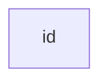
---

#### 带有文本的节点
使用`[]`将文本括起来
```
flowchart
    id1[节点]
```


---

#### 带有unicode文本的节点
使用`""`将unicode文本括起来。
```
flowchart
    id["❤"]
```


---

#### 带有Markdown文本的节点
使用`"``"`将Markdown文本括起来。
```
flowchart
    markdown["`This **is** _Markdown_`"]
```


>这个博客自带的Mermaid好像并不支持Markdown语法

---

#### 使用转义字符的代码
```
flowchart
    id["#9829;"]
```


---

### 方向
命令|方向
---|---
TD|从上到下
TB|从上到下
BT|从下到上
LR|从左到右
RL|从右到左
---
```
flowchart TB
    Start --> Stop
```
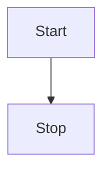
---
```
flowchart BT
    Start --> Stop
```
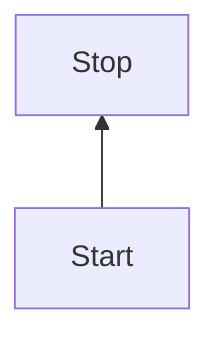
---
```
flowchart LR
    Start --> Stop
```

---
```
flowchart RL
    Start --> Stop
```

---

### 节点
命令|形状
---|---
[]|方形
()|圆边形
([])|体育场形
[[]]|子程序形
[()]|圆柱形
(())|圆形
\>]|不规则形
{}|菱形
[//]|平行四边形
[\\]|反平行四边形

---

```
flowchart
    id1[节点1]
    id2(节点2)
    id3([节点3])
    id4[[节点4]]
    id5[(节点5)]
    id6((节点6))
    id7>节点7]
    id8{节点8}
    id9[/节点9/]
    id10[\节点10\]
    id11[/节点11\]
    id12[\节点12/]
```


---

### 链接
命令|链接方式
---|---
---|直线链接
-->|箭头链接
-.-|虚线链接
-.->|虚线箭头链接
===|粗链接
==>|粗箭头链接
--o|圆边链接
--x|交叉边链接
o--o|两圆边链接
x--x|两交叉边链接
--文本---|带文本的直线链接
--文本-->|带文本的箭头链接
-.文本.-|带文本的虚线链接
-.文本.->|带文本的虚线箭头链接
==文本===|带文本的粗链接
==文本==>|带文本的粗箭头链接
--文本--o|带文本的圆边链接
--文本--x|带文本的交叉边链接
o--文本--o|带文本的两圆边链接
x--文本--x|带文本的两交叉边链接

---
```
flowchart
    A --- B
    C --> D
    E -.- F
    G -.-> H
    I === J
    K ==> L
```
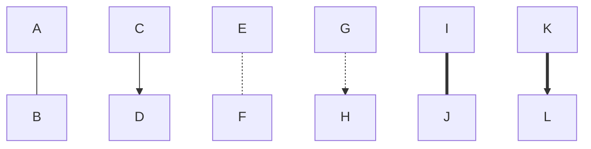
---
```
flowchart
    A --文本--- B
    C --文本--> D
    E -.文本.- F
    G -.文本.-> H
    I ==文本=== J
    K ==文本==> L
```
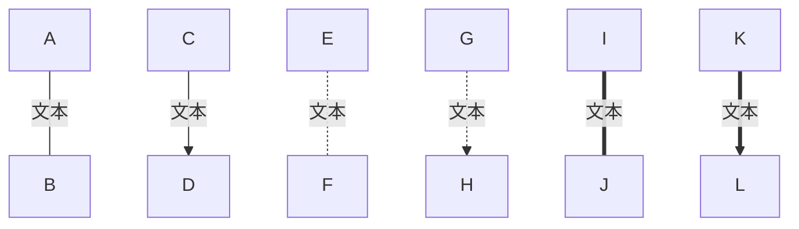
---
```
flowchart
    A --o B
    C --x D
    E o--o F
    G x--x H
    I --文本--o J
    K --文本--x L
    M o--文本--o N
    O x--文本--x P
```
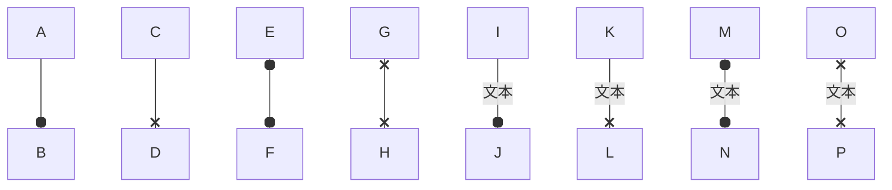
---
增加`- = .`号可以使得链接更长
```
flowchart
    A---B
    C----D
    E-----F
```
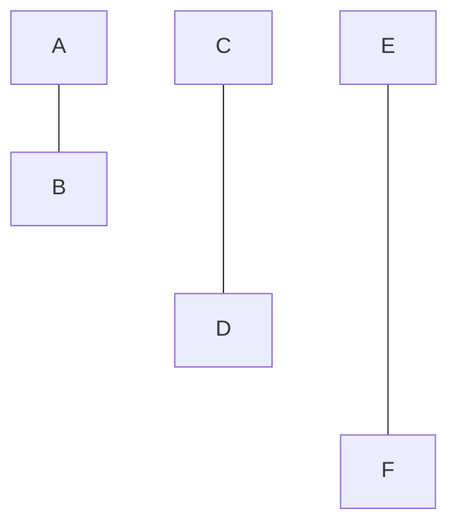

---

### 子图
#### 子图
用`subgraph title[]` `end`包裹起来为一个子图
```
flowchart

    c1-->a2

subgraph one
    a1-->a2
end

subgraph two
    b1-->b2
end

subgraph three
    c1-->c2
end
```

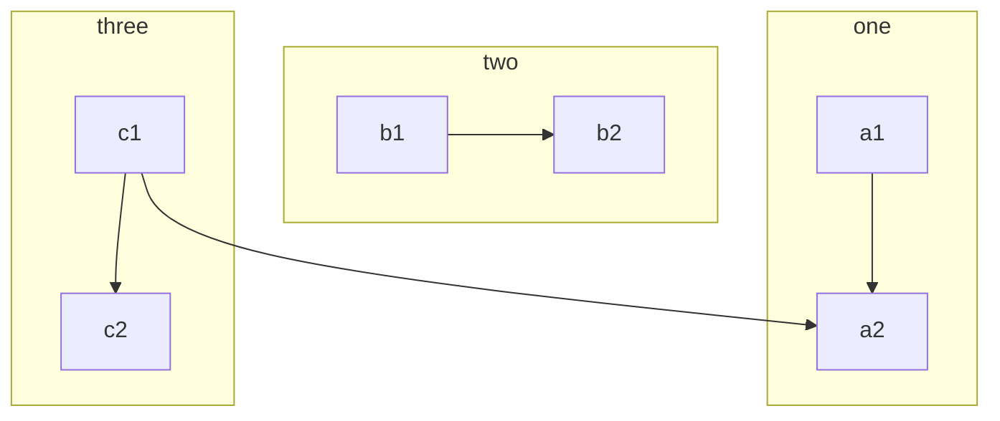
---
#### 子图的链接
子图与子图之间可以进行链接，子图和节点也能进行链接

```
flowchart

    subgraph one
    a1-->a2
    end

    subgraph two
    b1-->b2
    end

    subgraph three
    c1-->c2
    end

    one --> two
    a1 --> three
    two --> c1
```

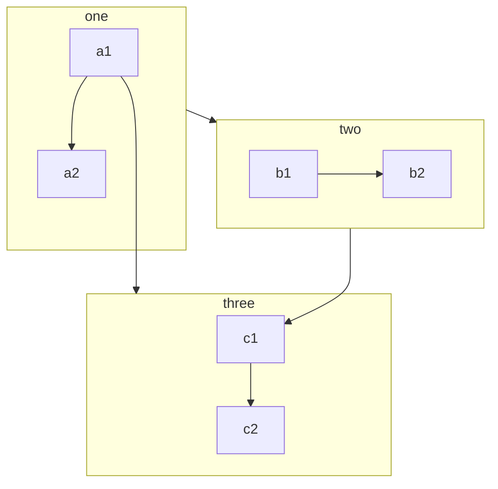
---
#### 子图的方向
可以用`direction XX`在子图中指明方向
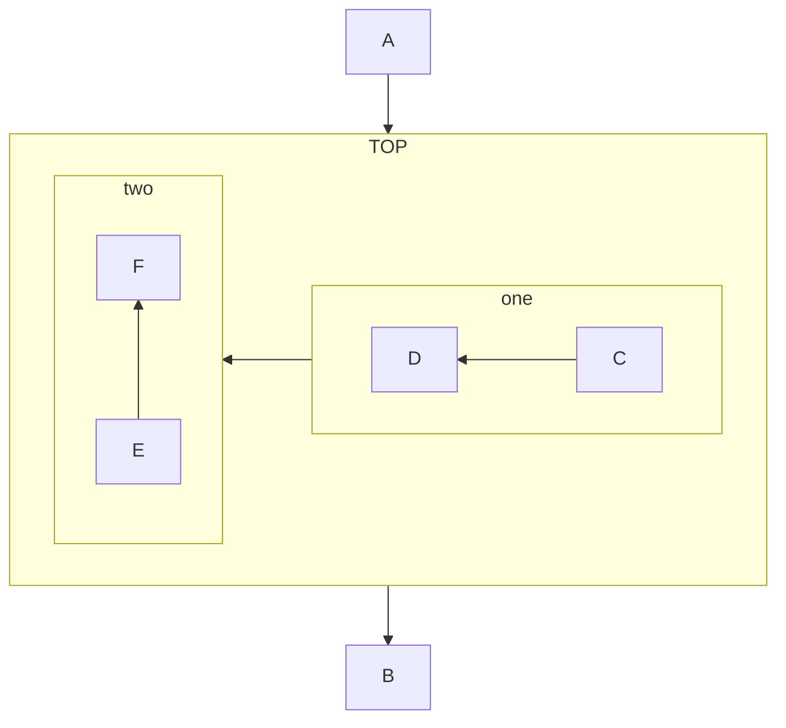
>如果任何子图的节点链接到外部，则子图方向将被忽略。相反，子图将继承父图的方向
---

### 节点链接

`click`即可跳转到目标网址

```
flowchart
    百度-->个人博客
    click 百度 "https://www.baidu.com/"
    click 个人博客 "https://cfn0324.github.io"
```
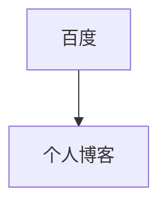
---

### 注释
使用`%%`即可在mermaid中注释
```
flowchart
    A-->B
    %% A指向B
```
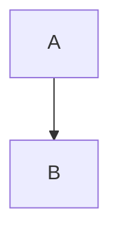
```mermaid
flowchart TD
    B["fa:fa-twitter for peace"]
    B-->C[fa:fa-ban forbidden]
    B-->D(fa:fa-spinner)
    B-->E(A fa:fa-camera-retro perhaps?)
```