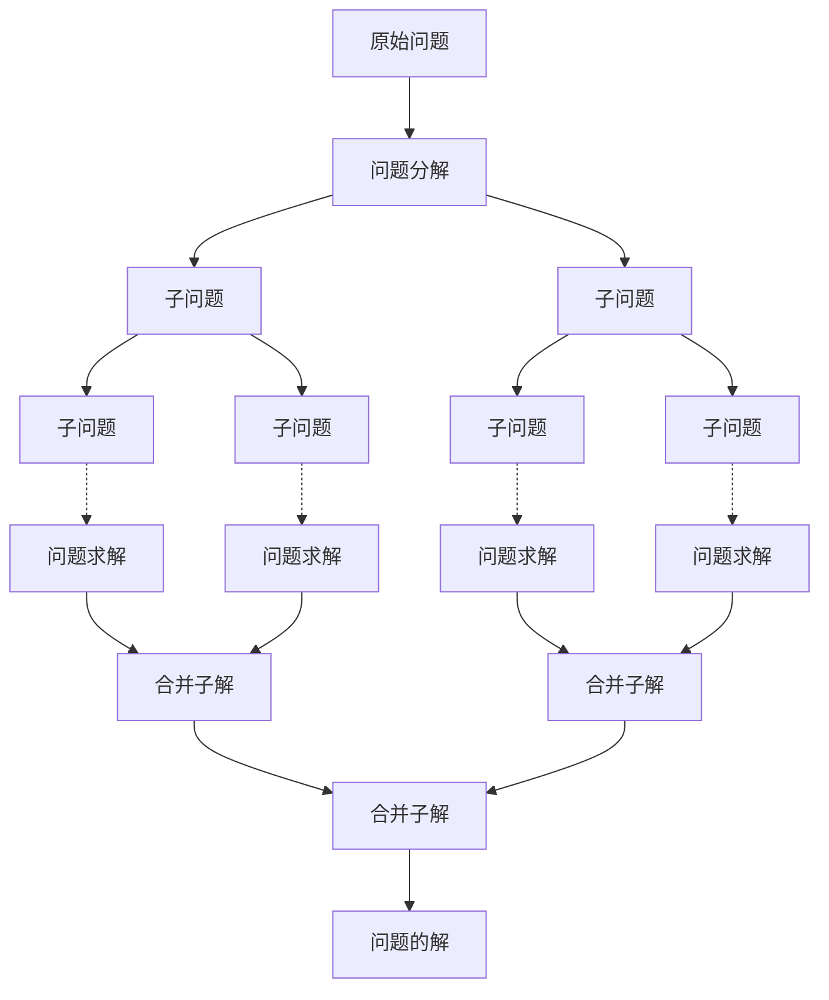

<!-- more -->

# 分治
## 什么是分治
分治法是算法设计方法的一种。它通过将问题划分为规模更小的子问题，递归地解决划分后的子问题，再将结果合并从而高效地解决问题。

## 分治的过程
他的流程可以分为三步：分解-->解决-->合并。
1. 分解原问题为结构相同的子问题
2. 分解到某个容易求解的边界之后，进行递归求解。
3. 将子问题的解合并成原问题的解。

>注意：如果各子问题是不独立的，则分治法要重复地解公共的子问题，也就做了许多不必要的工作。此时虽然也可用分治法，但一般用 动态规划 较好。



## 如何判断分治问题
一个问题是否适合使用分治解决，通常可以参考以下几个判断依据：
1. 问题可以分解：原问题可以分解成规模更小、类似的子问题，以及能够以相同方式递归地进行划分。
2. 子问题是独立的：子问题之间没有重叠，互不依赖、可以独立解决。
3. 子问题的解可以合并：原问题的解通过合并子问题的解得来。

## 分治的时间复杂度
假设将 $n$ 个问题分解为 $k$ 个 规模为 $\frac{n}{m}$ 子问题,合并和分解的时间复杂度设为 $f(n)$ ，故总的时间复杂度为：
$$T(n)=kT(\frac{n}{m} )+f(n)$$
通过求解（代换法、递归树法、主定理法），得出时间复杂度为：
$$T(n)=O(nlog(n))$$

## 分治的常见应用
分治不仅可以用来解决许多算法问题，还在数据结构的设计中应用得非常广泛。

算法：
* 寻找最近点对
* 大整数乘法
* 矩阵乘法
* 汉诺塔问题
* 求解逆序对
......

数据结构：
* 二分查找
* 归并排序
* 快速排序
* 桶排序
* 树
* 堆
......

## 例题
### [平面最近点对](https://www.luogu.com.cn/problem/P1429)
#### 题目描述

给定平面上 $n$ 个点，找出其中的一对点的距离，使得在这 $n$ 个点的所有点对中，该距离为所有点对中最小的

#### 输入格式

第一行：$n$ ，保证 $2\le n\le 200000$ 。

接下来 $n$ 行：每行两个实数：$x\ y$ ，表示一个点的行坐标和列坐标，中间用一个空格隔开。

#### 输出格式

仅一行，一个实数，表示最短距离，精确到小数点后面 $4$ 位。

#### 样例

##### 样例输入

```
3
1 1
1 2
2 2
```

##### 样例输出

```
1.0000
```

#### 提示

数据保证 $0\le x,y\le 10^9$

#### AC代码
```c++
#include <iostream>
#include <algorithm>
#include <cmath>
using namespace std;

typedef long long ll;

struct node{
    int x,y;
    bool operator <(const node a)const{
        if(x==a.x) return y<a.y;
        return x<a.x;
    }
};

bool cmp1(node a,node b){
    if(a.x==b.x) return a.y<b.y;
    return a.x<b.x;
}

bool cmp2(node a,node b){
    if(a.y==b.y) return a.x<b.x;
    return a.y<b.y;
}

node num1[400005];
node num2[400005];

ll fz(int l,int r){
    if(l==r) return 0x3f3f3f3f3f3f3f3f;
    int mid=(l+r)/2;
    ll d1=fz(l,mid);
    ll d2=fz(mid+1,r);
    ll d=min(d1,d2);
    int cnt=0;
    //int l2=lower_bound(num1+l,num1+r+1,node{num1[mid].x-d,0})-num1;
    //int r2=upper_bound(num1+l,num1+r+1,node{num1[mid].x+d,0})-num1;
    for(int i=l;i<=r;i++){
        if(abs(num1[i].x-num1[mid].x)<d){
            num2[++cnt]=num1[i];
        }else{
            break;
        }
    }
    sort(num2+1,num2+1+cnt,cmp2);
    for(int i=1;i<=cnt;i++){
        for(int j=i+1;j<=cnt&&j<=i+7;j++){
            d=min(d,1LL*(num2[i].x-num2[j].x)*(num2[i].x-num2[j].x)+1LL*(num2[i].y-num2[j].y)*(num2[i].y-num2[j].y));
        }
    }
    return d;
}

int main(){
    int n;
    cin>>n;
    for(int i=1;i<=n;i++){
        cin>>num1[i].x>>num1[i].y;
    }
    sort(num1+1,num1+1+n,cmp1);
    ll ans=fz(1,n);
    printf("%.4f",sqrt(ans));

    return 0;
}
```