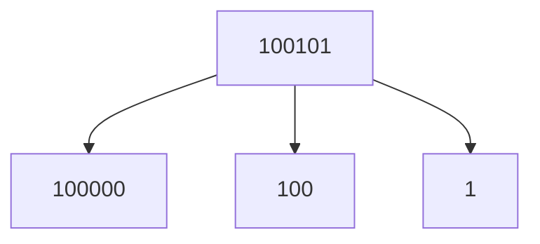

<!-- more -->

# 倍增

## 倍增思想

### 定义
倍增法（英语：binary lifting），顾名思义就是翻倍。它能够使线性的处理转化为对数级的处理，大大地优化时间复杂度。

### 原理
我们可以对任意一个数字拆成二进制的形式，例如 $37$ 的二进制形式为 $100101$ ，可以拆成 $32(100000)+4(100)+1(1)$ 之和，故只要预处理 $1、2、4、8......log_2(n)$，任意数都能转换成这些数的组合，不用对每一个数都进行处理，从而降低时间复杂度。


## 倍增在快速幂上的应用

### [【模板】快速幂](https://www.luogu.com.cn/problem/P1226)

#### 题目描述

给你三个整数 $a,b,p$，求 $a^b \bmod p$。

#### 输入格式

输入只有一行三个整数，分别代表 $a,b,p$。

#### 输出格式

输出一行一个字符串 `a^b mod p=s`，其中 $a,b,p$ 分别为题目给定的值， $s$ 为运算结果。

#### 样例 #1

##### 样例输入 #1

```
2 10 9
```

##### 样例输出 #1

```
2^10 mod 9=7
```

#### 提示

**样例解释**

$2^{10} = 1024$，$1024 \bmod 9 = 7$。

**数据规模与约定**

对于 $100\%$ 的数据，保证 $0\le a,b < 2^{31}$，$a+b>0$，$2 \leq p \lt 2^{31}$。

#### AC代码

```c++
#include <iostream>
using namespace std;

typedef long long ll;

ll ksm(ll a,ll b,ll p){
    ll ans=1;
    while(b){
        if(b&1){
            ans=ans*a%p;
        }
        a=a*a%p;
        b/=2;
    }
    return ans;
}

int main(){
    int a,b,p;
    cin>>a>>b>>p;
    printf("%d^%d mod %d=%d",a,b,p,ksm(a,b,p));

    return 0;
}
```

## 倍增在LCA中的应用

### [【模板】最近公共祖先（LCA）](https://www.luogu.com.cn/problem/P3379)

#### 题目描述

如题，给定一棵有根多叉树，请求出指定两个点直接最近的公共祖先。

#### 输入格式

第一行包含三个正整数 $N,M,S$，分别表示树的结点个数、询问的个数和树根结点的序号。

接下来 $N-1$ 行每行包含两个正整数 $x, y$，表示 $x$ 结点和 $y$ 结点之间有一条直接连接的边（数据保证可以构成树）。

接下来 $M$ 行每行包含两个正整数 $a, b$，表示询问 $a$ 结点和 $b$ 结点的最近公共祖先。

#### 输出格式

输出包含 $M$ 行，每行包含一个正整数，依次为每一个询问的结果。

#### 样例 #1

##### 样例输入 #1

```
5 5 4
3 1
2 4
5 1
1 4
2 4
3 2
3 5
1 2
4 5
```

##### 样例输出 #1

```
4
4
1
4
4
```

#### 提示

对于 $30\%$ 的数据，$N\leq 10$，$M\leq 10$。

对于 $70\%$ 的数据，$N\leq 10000$，$M\leq 10000$。

对于 $100\%$ 的数据，$1 \leq N,M\leq 500000$，$1 \leq x, y,a ,b \leq N$，**不保证** $a \neq b$。


样例说明：

该树结构如下：

  

第一次询问：$2, 4$ 的最近公共祖先，故为 $4$。

第二次询问：$3, 2$ 的最近公共祖先，故为 $4$。

第三次询问：$3, 5$ 的最近公共祖先，故为 $1$。

第四次询问：$1, 2$ 的最近公共祖先，故为 $4$。

第五次询问：$4, 5$ 的最近公共祖先，故为 $4$。

故输出依次为 $4, 4, 1, 4, 4$。


2021/10/4 数据更新 @fstqwq：应要求加了两组数据卡掉了暴力跳。

#### AC代码

```c++
#include <iostream>
#include <vector>
#include <queue>
using namespace std;

vector<int> vt[500005];
queue<int> qe;
int fa[500005][31],depth[500005];

void bfs(int root){
    qe.push(root);
    depth[root]=1;
    while(!qe.empty()){
        int x=qe.front();
        qe.pop();
        for(int y:vt[x]){
            if(depth[y]==0){
                qe.push(y);
                depth[y]=depth[x]+1;
                fa[y][0]=x;
                for(int i=1;i<=30;i++){
                    fa[y][i]=fa[fa[y][i-1]][i-1];
                }                
            }
        }
    }
}

int lca(int a,int b){
    if(depth[a]<depth[b])swap(a,b);
    for(int i=30;i>=0;i--){
        if(depth[fa[a][i]]>=depth[b])
        a=fa[a][i];
    }
    if(a==b)return a;
    for(int i=30;i>=0;i--){
        if(fa[a][i]!=fa[b][i]){
            a=fa[a][i];
            b=fa[b][i];
        }
    }
    return fa[a][0];
}

int main(){
    int n,m,s,a,b;
    ios::sync_with_stdio(0);
    cin.tie(0);cout.tie(0);
    cin>>n>>m>>s;
    for(int i=1;i<=n-1;i++){
        cin>>a>>b;
        vt[a].push_back(b);
        vt[b].push_back(a);
    }
    bfs(s);
    for(int i=1;i<=m;i++){
        cin>>a>>b;
        cout<<lca(a,b)<<"\n";
    }

    return 0;
}
```

## 倍增在ST表中的应用

### [【模板】ST 表](https://www.luogu.com.cn/problem/P3865)

#### 题目背景

这是一道 ST 表经典题——静态区间最大值

**请注意最大数据时限只有 0.8s，数据强度不低，请务必保证你的每次查询复杂度为 $O(1)$。若使用更高时间复杂度算法不保证能通过。**

如果您认为您的代码时间复杂度正确但是 TLE，可以尝试使用快速读入：

```cpp
inline int read()
{
	int x=0,f=1;char ch=getchar();
	while (ch<'0'||ch>'9'){if (ch=='-') f=-1;ch=getchar();}
	while (ch>='0'&&ch<='9'){x=x*10+ch-48;ch=getchar();}
	return x*f;
}
```

函数返回值为读入的第一个整数。

**快速读入作用仅为加快读入，并非强制使用。**

#### 题目描述

给定一个长度为 $N$ 的数列，和 $ M $ 次询问，求出每一次询问的区间内数字的最大值。

#### 输入格式

第一行包含两个整数 $N,M$，分别表示数列的长度和询问的个数。

第二行包含 $N$ 个整数（记为 $a_i$），依次表示数列的第 $i$ 项。

接下来 $M$ 行，每行包含两个整数 $l_i,r_i$，表示查询的区间为 $[l_i,r_i]$。

#### 输出格式

输出包含 $M$ 行，每行一个整数，依次表示每一次询问的结果。

#### 样例 #1

##### 样例输入 #1

```
8 8
9 3 1 7 5 6 0 8
1 6
1 5
2 7
2 6
1 8
4 8
3 7
1 8
```

##### 样例输出 #1

```
9
9
7
7
9
8
7
9
```

#### 提示

对于 $30\%$ 的数据，满足 $1\le N,M\le 10$。

对于 $70\%$ 的数据，满足 $1\le N,M\le {10}^5$。

对于 $100\%$ 的数据，满足 $1\le N\le {10}^5$，$1\le M\le 2\times{10}^6$，$a_i\in[0,{10}^9]$，$1\le l_i\le r_i\le N$。

#### AC代码
```c++
#include <iostream>
#include <cmath>
using namespace std;

int num[100005],f[100005][30];

void st(int n){
    int t=log2(n);
    for(int i=1;i<=n;i++)f[i][0]=num[i];
    for(int i=1;i<=t;i++){
        for(int j=1;j+(1<<i)-1<=n;j++){
            f[j][i]=max(f[j][i-1],f[j+(1<<(i-1))][i-1]);
        }
    }
}

int find(int l,int r){
    int t=log2(r-l+1);
    return max(f[l][t],f[r-(1<<t)+1][t]);
}

int main(){
    ios::sync_with_stdio(0);
    cin.tie(0);cout.tie(0);
    int n,m;
    cin>>n>>m;
    for(int i=1;i<=n;i++){
        cin>>num[i];
    }
    st(n);
    int a,b;
    for(int i=1;i<=m;i++){
        cin>>a>>b;
        cout<<find(a,b)<<"\n";
    }

    return 0;
}
```